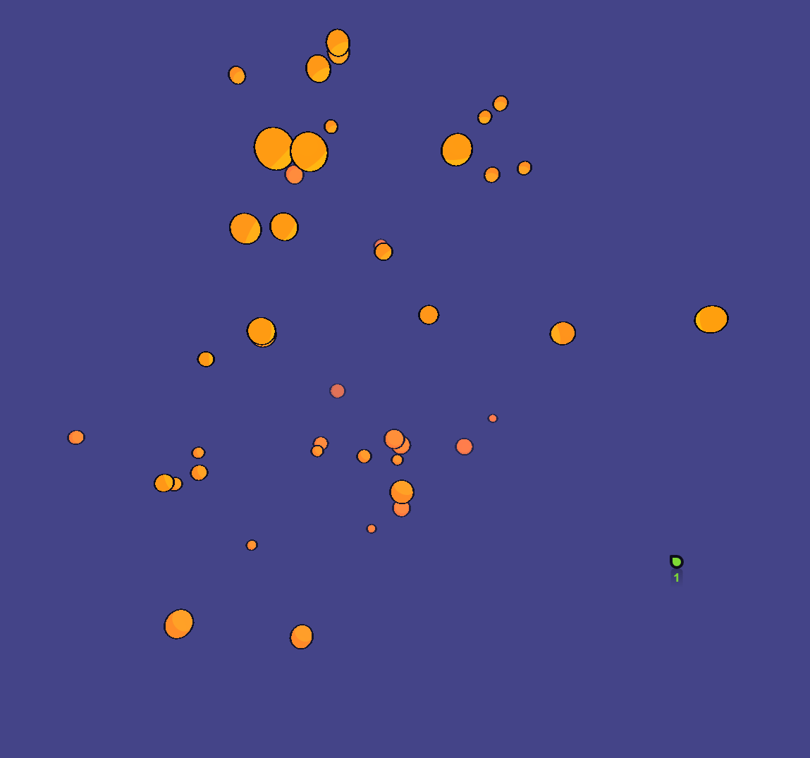

# 🎮 3D clicker like con Three.js

Este pequeño proyecto realizado ofrece un escenario interactivo en tres dimensiones donde los usuarios pueden interactuar mediante clics para rotar la cámara. Al pasar el ratón por encima de esferas amarillas, el jugador acumula puntos, con la posibilidad aleatoria de obtener puntos extra. Proyecto personal para aprender a utilizar la libreria three.js.




## 📦 Instalación

Para descargar y ejecutar el proyecto, siga estos pasos:

1. Clonar el repositorio:
    ```bash
    git clone https://github.com/tu-usuario/tu-repositorio.git
    ```

2. Navegar al directorio del proyecto:
    ```bash
    cd tu-repositorio
    ```

3. Instalar las dependencias:
    ```bash
    npm install
    ```

4. Iniciar el servidor de desarrollo:
    ```bash
    npm run dev
    ```

El proyecto estará disponible para su visualización y uso en el navegador en el puerto :5173.


## 🎮 Cómo Jugar

- Haga clic para rotar la cámara en el escenario 3D.
- Pase el ratón por encima de las esferas amarillas para sumar puntos.
- ¡Existe una posibilidad de que cada esfera otorgue el doble de puntos!

### 📱 ¡Juega desde tu móvil!

Si estás conectado a una red local, puedes jugar fácilmente desde tu dispositivo móvil. Solo necesitas seguir estos pasos:

1. Asegúrate de estar conectado a la misma red local que tu computadora.
2. Abre el navegador en tu dispositivo móvil.
3. En la barra de direcciones, ingresa la dirección IP de tu computadora seguida por el puerto `5173`. Por ejemplo: 192.168.0.17:5173

## ⚠️ Advertencia de Sonido

🔊 **El sonido puede ser alto.** Se recomienda ajustar el volumen de los altavoces o auriculares antes de comenzar a jugar.


